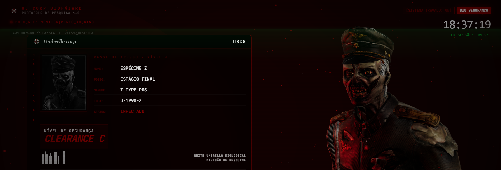

# ☣️ ESPÉCIME Z: Terminal de Monitoramento Biométrico

> **Status: [CONFIDENCIAL]** | **Protocolo: Umbrella Corp.** | **Desenvolvedor: Gabriel Lima**

Uma interface de terminal de alta fidelidade desenvolvida para o monitoramento em tempo real de espécimes biológicos. Este projeto funde design industrial brutalista com tecnologias modernas de renderização 3D, criando uma experiência imersiva de "User Interface" (UI) cinematográfica.

 


## 🔬 Visão Geral
O **Espécime Z** não é apenas um dashboard; é um sistema de visualização técnica que simula o controle de uma instalação da Umbrella. Utilizando **React Three Fiber**, o terminal renderiza modelos 3D que reagem dinamicamente ao progresso de navegação (scroll), simbolizando estados de agressividade e vitalidade do espécime.

## 🚀 Tecnologias de Elite
- **Framework:** [Next.js 16 (App Router)](https://nextjs.org/)
- **Visualização 3D:** [React Three Fiber](https://r3f.docs.pmnd.rs/) & [Drei](https://github.com/pmndrs/drei)
- **Animações:** [Framer Motion](https://www.framer.com/motion/)
- **Estilização:** [Tailwind CSS](https://tailwindcss.com/)
- **Design System:** Custom CSS (Efeitos de Blackout, Scanlines e Biometria)

## 🛠️ Funcionalidades Principais
- **Sincronização 3D-Scroll:** Transição suave entre estados de animação (Idle, Walking, Running) baseada na profundidade da página.
- **Biometria em Tempo Real:** Gráficos de pulsação e atividade cerebral com animações de varredura (scanning).
- **HUD Confidential:** Interface minimalista e institucional com tipografia escalável para Desktop e Mobile.
- **Experiência Mobile Adaptativa:** Sistema de minimizar/maximizar cards para garantir foco no modelo 3D em dispositivos móveis.
- **Grand Finale Cinematográfico:** Sequência de encerramento com blackout e erro crítico do sistema.

## 📦 Configuração e Execução
Certifique-se de ter o Node.js instalado.

```bash
# Clone o repositório
git clone https://github.com/seu-usuario/especie-z.git

# Entre no diretório
cd especie-z

# Instale as dependências
npm install

# Inicie o servidor de desenvolvimento
npm run dev
```

Abra [http://localhost:3000](http://localhost:3000) para iniciar o monitoramento.

## ✍️ Créditos e Estudos
Este projeto foi desenvolvido por **Gabriel Lima** como um estudo aprofundado de:
- Integração de ambientes 3D em aplicações Web.
- Design de interfaces temáticas de alta fidelidade (Sci-Fi/Horror).
- UX interativa baseada em scroll-triggering.

---
© 2026 Gabriel Lima. Desenvolvido para fins de estudo e portfólio.
